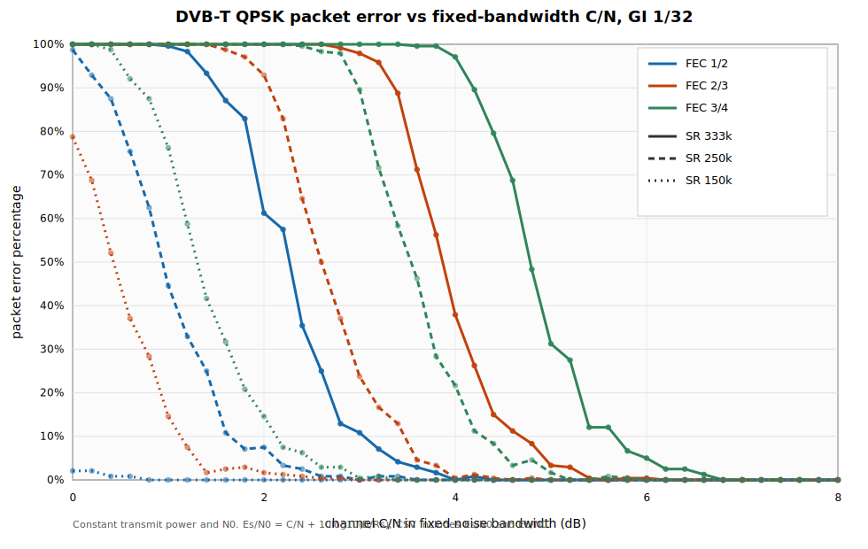
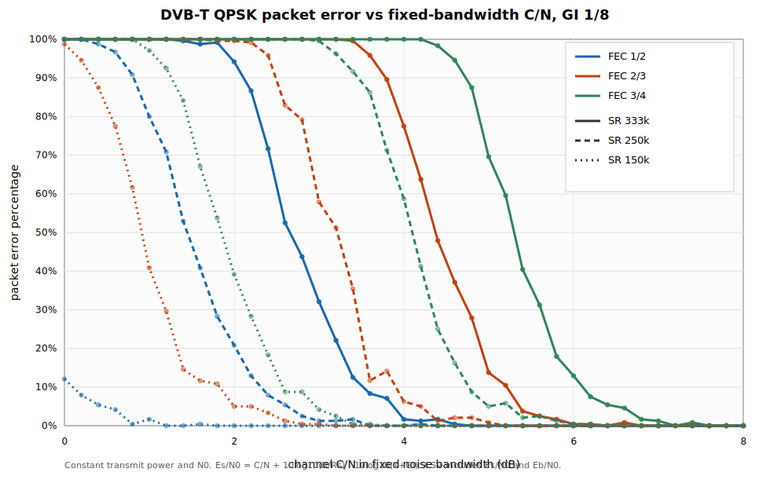

# rbdvbt_rx

`rbdvbt_rx` is een reduced-bandwidth DVB-T ontvanger voor amateur-DATV
experimenten. Het programma leest complex IQ van `stdin`, demoduleert een
bekend DVB-T QPSK signaal en schrijft MPEG-TS pakketten naar `stdout` of naar
een bestand.

Het programma is bedoeld voor Portsdown-achtige DVB-T signalen met lage
symbolrates, bijvoorbeeld `150k`, `250k` en `333k`.

## Doel

De primaire use-case is:

```text
IQ opname of SDR stream -> rbdvbt_rx -> MPEG-TS -> ffplay/VLC
```

Belangrijke ontwerpkeuzes:

- `stdout` is schoon en bevat alleen MPEG-TS wanneer `--stdout-ts` of
  `--ts-out -` wordt gebruikt.
- Diagnostiek en voortgang gaan naar `stderr`.
- De ontvanger accepteert expliciete DVB-T parameters; TPS-autodetectie is nog
  geen onderdeel van de lock-keten.
- De status kan periodiek als JSON worden geschreven voor monitoring in een
  tweede terminal.

## Installatie

Benodigd:

- CMake 3.16 of nieuwer
- C compiler met C11 ondersteuning
- C++ compiler met C++11 ondersteuning
- `pkg-config`
- FFTW3 single precision development package (`fftw3f`)

Build:

```sh
cmake -S . -B build
cmake --build build -j
```

Belangrijkste binaries:

```text
build/rbdvbt_rx             DVB-T receiver
build/rbdvbt_status_watch   terminal monitor voor status JSON
build/dvbt_fec_snr_plot     hulpprogramma voor performancegrafieken
```

## Basisgebruik

Voor een IQ-bestand met interleaved signed 16-bit IQ:

```sh
./build/rbdvbt_rx \
  --probe-constellation \
  --resample-to-dvbt-rate \
  --dvbt-ir 1 \
  --stdin \
  --input-format s16 \
  --sample-rate 1010526 \
  --sr 333k \
  --gi 1/32 \
  --fec 2/3 \
  --stdout-ts \
  < recordings/dvbt-333k-g32-20260322.iq | ffplay -
```

Naar een TS-bestand schrijven:

```sh
./build/rbdvbt_rx \
  --probe-constellation \
  --resample-to-dvbt-rate \
  --dvbt-ir 1 \
  --stdin \
  --input-format s16 \
  --sample-rate 1010526 \
  --sr 333k \
  --gi 1/32 \
  --fec 2/3 \
  --ts-out recovered.ts \
  < capture.iq
```

Met status JSON:

```sh
./build/rbdvbt_rx \
  --probe-constellation \
  --resample-to-dvbt-rate \
  --dvbt-ir 1 \
  --stdin \
  --input-format s16 \
  --sample-rate 1010526 \
  --sr 333k \
  --gi 1/32 \
  --fec 2/3 \
  --stdout-ts \
  --status-json /tmp/rx_status.json \
  --status-period-packets 50 \
  < capture.iq | ffplay -
```

Status bekijken in een tweede terminal:

```sh
./build/rbdvbt_status_watch /tmp/rx_status.json
```

## Parameters

### Invoer

| Parameter | Betekenis |
|---|---|
| `--stdin` | Lees IQ van standaardinvoer. Verplicht. |
| `--input-format s16` | Interleaved signed 16-bit little-endian IQ. |
| `--input-format u8` | Interleaved unsigned 8-bit IQ. |
| `--sample-rate HZ` | Sample rate van het IQ-bestand of de SDR-stream. |
| `--max-samples N` | Verwerk maximaal `N` IQ samples. Handig voor tests. |

### DVB-T mode

| Parameter | Keuzes | Betekenis |
|---|---|---|
| `--sr` | `125k`, `250k`, `333k`, `500k` | DVB-T symbolrate preset. |
| `--gi` | `1/8`, `1/16`, `1/32` | Guard interval. |
| `--fec` | `1/2`, `2/3`, `3/4`, `5/6`, `7/8` | Inner FEC puncturing rate. |
| `--dvbt-ir` | `1`, `2`, `4`, `8` | Interpolation/rate factor voor de DVB-T sample grid. |
| `--resample-to-dvbt-rate` | vlag | Resample naar de verwachte DVB-T 2K grid. |

### Output en debug

| Parameter | Betekenis |
|---|---|
| `--stdout-ts` | Schrijf MPEG-TS naar `stdout`. Equivalent aan `--ts-out -`. |
| `--ts-out FILE` | Schrijf MPEG-TS naar bestand. Gebruik `-` voor `stdout`. |
| `--constellation-out FILE.csv` | Schrijf QPSK constellatiepunten. |
| `--constellation-svg FILE.svg` | Schrijf QPSK constellatie als SVG. |
| `--demap-out FILE.csv` | Schrijf gedemapte dibits. |
| `--viterbi-out FILE.bin` | Schrijf bytes na inner Viterbi decoder. |
| `--status-json FILE.json` | Schrijf periodiek receiverstatus als JSON. |
| `--status-period-packets N` | Statusupdate elke `N` TS packets; tijdens input elke `N * 4096` IQ samples. |

## Parameterkeuze

### Symbolrate

Lagere symbolrates geven bij gelijke totale zendpower meer energie per symbool.
Dat helpt vooral bij korte aircraft-scatter momenten en fading. De prijs is
lagere netto bitrate.

| Symbolrate | Gebruik |
|---|---|
| `333k` | Goede keuze als het reflectiemoment stabiel genoeg is en throughput telt. |
| `250k` | Praktische middenweg voor aircraft-scatter tests. |
| `150k` | Robuust wanneer het bruikbare moment kort is of fading dominant is. |

### FEC

| FEC | Gebruik |
|---|---|
| `1/2` | Meest robuust, laagste netto bitrate. |
| `2/3` | Goede standaard voor veel tests. |
| `3/4` | Meer bitrate, duidelijk minder marge bij fading. |
| `5/6`, `7/8` | Alleen gebruiken bij veel marge en stabiele condities. |

### Guard interval

Guard interval helpt tegen echo-delay/multipath. Het helpt niet tegen diepe
fading door interferentie tussen direct/tropo en aircraft-scatter paden.

Bij gelijke totale zendpower kost guard overhead nuttige energie:

```text
GI 1/32: 10log10(1 + 1/32) = 0.13 dB
GI 1/8 : 10log10(1 + 1/8)  = 0.51 dB
```

`GI 1/8` kost dus ongeveer `0.38 dB` extra ten opzichte van `GI 1/32`. Gebruik
daarom standaard de kortste guard die de echo-delay opvangt.

## Aircraft Scatter

Voor aircraft scatter moet je eerst bepalen welk effect de link beperkt:

- **Echo-delay dominant:** delayed echo's vallen buiten de guard of verstoren de
  OFDM-symbolen.
- **Moment/fading dominant:** het reflectiemoment is kort, of direct/tropo en
  aircraft-scatter interfereren en veroorzaken snelle fades.

Beslisregel:

```text
Gebruik de kortste guard interval die de echo-delay opvangt.
Als het probleem moment/fading is, kies lagere symbolrate en sterkere FEC
voordat je de guard vergroot.
```

### Echo-Delay Dominant

Gebruik deze tabel wanneer lock of packet errors duidelijk verbeteren met een
langere guard interval.

| Situatie | Aanbevolen setting | Reden |
|---|---|---|
| Korte echo-delay, stabiel pad | `333k`, FEC `2/3`, GI `1/32` | Beste throughput met minimale guard overhead. |
| Korte echo-delay, beperkte marge | `250k`, FEC `2/3`, GI `1/32` | Meer energie per symbool, nog steeds lage guard overhead. |
| Matige echo-delay | `250k`, FEC `2/3`, GI `1/16` | Meer echo-delay tolerantie met beperkte overhead. |
| Lange echo-delay / duidelijke multipath | `250k`, FEC `1/2`, GI `1/8` | Robuuste FEC plus langere guard voor delayed aircraft reflections. |
| Extreme delay spread | `150k`, FEC `1/2`, GI `1/8` | Maximale robuustheid binnen deze presets; bitrate is ondergeschikt. |

### Moment/Fading Dominant

Gebruik deze tabel wanneer de aircraft-reflectie sterk genoeg is, maar slechts
kort bruikbaar is of snel in fading verdwijnt.

| Situatie | Aanbevolen setting | Reden |
|---|---|---|
| Zeer korte momenten / diepe flutter | `150k`, FEC `1/2`, GI `1/32` | Beste robuustheid tegen packet bursts en korte fades. |
| Korte maar bruikbare momenten | `150k`, FEC `2/3`, GI `1/32` | Behoudt het lagere-symbolrate voordeel met meer payload dan FEC `1/2`. |
| Normale aircraft-scatter testmodus | `250k`, FEC `2/3`, GI `1/32` | Goede balans tussen packet rate en fade-tolerantie. |
| Sterkere, langere reflectie | `333k`, FEC `2/3`, GI `1/32` | Hogere throughput wanneer het moment stabiel genoeg is. |
| Zeer stabiele reflectie / veel marge | `333k`, FEC `3/4`, GI `1/32` | Meer bitrate, maar minder robuust tegen fades. |

Als `GI 1/8` geen duidelijke verbetering geeft in lockduur of packet-error
bursts, is de hoofdoorzaak waarschijnlijk fading/timing en niet echo-delay.
Verlaag dan de symbolrate of gebruik sterkere FEC.

## Decoder Performance

De performancegrafieken zijn Monte Carlo simulaties van de inner FEC-keten:

```text
random 188-byte packets
-> convolutional encoder
-> puncturing
-> QPSK AWGN kanaal
-> soft Viterbi
-> packet bit-perfect check
```

De simulatie houdt totale zendpower constant en houdt noise spectral density
constant. De x-as is channel C/N in een vaste meetbandbreedte van 333 kHz.
Per symbolrate wordt omgerekend naar:

```text
Es/N0 = C/N + 10log10(B/Rs) - 10log10(1+GI)
Eb/N0 = Es/N0 - 10log10(2)
```

De y-as is packet error percentage:

```text
packet_error_percent = (offered_packets - correct_packets) / offered_packets * 100
```

### Guard 1/32



Deze grafiek vergelijkt `333k`, `250k` en `150k`, elk met FEC `1/2`, `2/3` en
`3/4`, met guard `1/32`.

### Guard 1/8



Deze grafiek gebruikt dezelfde symbolrates en FECs, maar met guard `1/8`. Door
de guard-overhead schuiven de curves ongeveer `0.38 dB` ongunstiger dan bij
`1/32`, tenzij de langere guard in de praktijk echo-delay problemen oplost.

## Licentie

Deze software mag worden gebruikt, aangepast en verspreid, ook in afgeleide
projecten, mits de oorspronkelijke auteur duidelijk wordt vermeld.

Zie [LICENSE](LICENSE) voor de volledige voorwaarden.
